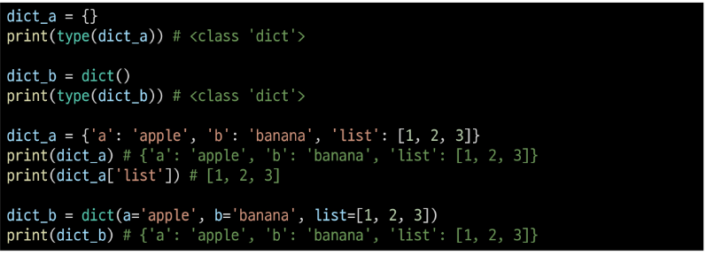

# 2022 07 18

# ※한번 저장후 이미지 추가하기※

### 파이썬 인터프리터 언어

- 한줄씩 통역하듯이 변환
- 객체 지향 프로그래밍

### 개발환경

- IDE
- 주피터 노트북 문법학습용 한줄한줄 실행가능
- IDLE

### 단축키

- alt 클릭 여러줄
- alt 컨트롤 여러줄 선택
- alt 화살표 순서 바꾸기
- control d 선택된 단어 바꿈
- alt shift 화살표 밑으로 복사

### 자료형

- 참/거짓
- 숫자
- 문자열

### 진수

- 0b 2진수
- 0o 8진수
- 0x 16진수

### 실수 연수 주의할점

- 수치해석적 오류 생김
- math.isclose 함수로 해결

### 문자열 자료형

- 삼중따음표

- 문자열 내에 따음표 쓸거면 서로 다른걸로 사용

- 역슬러쉬 \
  
  - \n 줄 바꿈
  - \t 탭
  - \r 커서를 맨앞으로
  - \0 null
  - \\\\ \\
  - \' '
  - \" "

- 덧셈 곱셈 가능

- string interpolation

- 예시: name을 출력
  
  - print(%s,%name)
  
  - print({},format(name))
  
  - print(f'{name}')
  
  ### None

- 값이 없음을 표현
  
  ### Boolean 형

- 참 거짓 표현

- True False 값을 가짐

- 비교 논리 연산에 활용

- 비교 연산자
  
  - is 객체 아이덴티디
  
  - is not 객체 아이덴티디가 아님

- 논리 연산자
  
  - and or Not
  
  - 0, (),[],{} "" 빈 자료형 false로 취급
  
  - not and or 순으로 우선순위
  
  - 3 and 5  5 둘다 true면 뒤에값 출력
  
  - 5 or 3 5 마지막으로 평가한 값 출력 (5만 봐도 true)
  
  ### 연산자

- / 나눗셈

- // 몫

- '**' 거듭제곱

### 컨테이너

- 순서: 리스트, 튜플, 레인지

- 비시퀀스 : 세트 딕셔너리

- 튜플, 레인지 형은 변형 불가

### list

- boxes[2][-1]         boxes[2]의 마지막 값 

### tuple

- list와 비슷하나 변경 불가

- () 소괄호 사용

- tuple_a= (1,)  하나만 쓰면 쉼표!

- tuple_b= (1,2,3,) trailing edge 습관 들이기

### range

- range(n,m,s) n에서 m-1까지 S만큼 증가

### 슬라이싱 연산자

- 인덱스와 콜론을 사용하여 문자열 특정 부분만 잘라낼수 있음

- [::-1]가꾸로

- [::] 전부ㅡ

### set

- 중복되는 요소 없고 순서 없음

- 가변 자료

- 집합연산가능

- | 합집합

- & 교집합

- -차집합

- ^대칭차집합

### dictionary

- key- value 쌍으로 이루워진 자료형

-  3.7부터는 ordered (순서)

- key는 변경 불가능한 데이터만 활용가능

- value는 관계없음

### 자료형 변환

- 암시적 형 변환
  
  - 내부적으로 자료형 변환
  
  - bool, numeric type ( int, float)

- 특정 함수를 활용하여 의도적으로 자료형을 변환하는경우
  
  - int(), float(), str(), list(), set(), dict  key 만

# SSAFY

## 월~금

- 5시~:  온라인 실습실 문제 1개이상제출 
  
  - 5시 50분까지

- 5시50분 데일리 설문

- 6시후: homework, workshop 풀어서 제출 
  
  - 당일 23:59분
  
  - git으로
