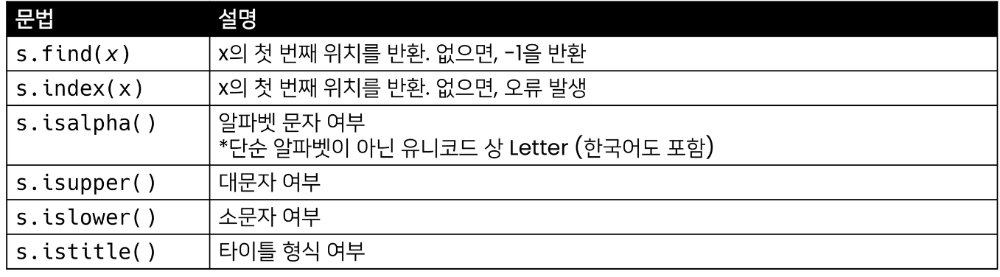
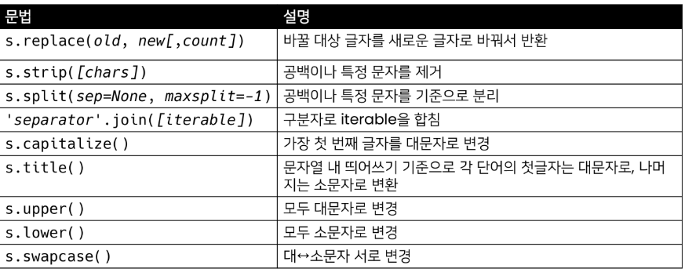
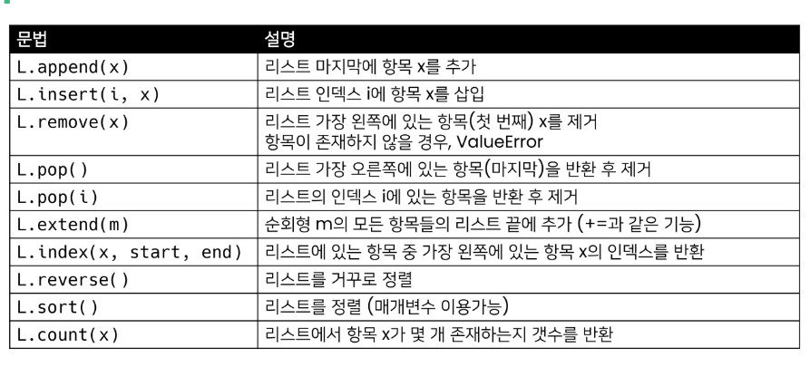
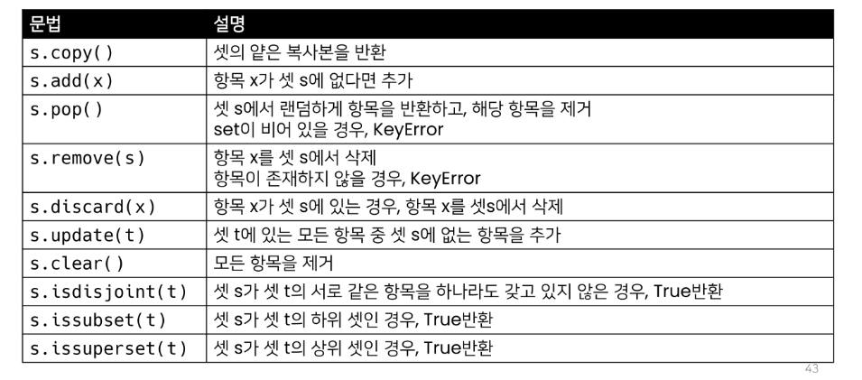
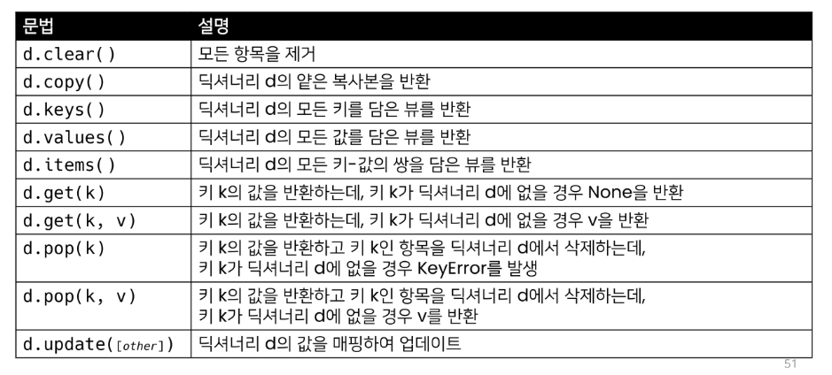

# 0725 데이터 구조

### method

### 문자열

- .isdecimal < .isdigit < isnumeric 숫자 관련 매서드

### 리스트

sorted(list)는 새로운 리스트를 만듬!

extend() 는 += 와 같음

### 세트

### 딕셔너리

### 복사방법

- 할당

- 얕은 복사

- 깊은 복사

### 얕은 복사

복사하는 리스트의 원소가 주소를 참조 하는경우

변경시 원본 복사본 모두 값 변경됨

list()

copy()

### 깊은 복사

deepcopy()
