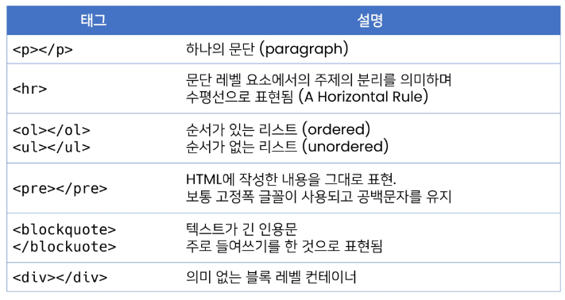

# html 기본구조

- Hyper Text Markup Language : 하이퍼 링크를 통해 사용자가 다른 문서로 즉시 접근 할수 있는 텍스트

- HTML 웹페이지를 작성하기 위한 언어

- html: 문서 최상위 요소

- head 문서 메타데이터 요소
  
  - 문서 제목, 인코딩, 스타일, 외부 파일 로딩등 일반적으로 브라우저에 나타나지 않는 내용

- body 문서본문 요소

### head

- <title> 브라우저 상단 타이틀

- <meta> 문서레벨 메타 데이터 요소

- <link> 외부 리소스 연결 요소

- <script> 스크립트 요소 (자바 스크립트 파일 , 코드)

- <style>  css직접 작성

### 요소

- 여는 태그 닫는 태그

- 요소는 중첩 가능

### 속성

- 속성명 = 속성값

- 공백x 쌍따옴표 사용

- <!--주석입니다.--> 

- 

### 시맨틱 태그

- 의미론적 태그

### 랜더링

- 웹사이트

# HTML 문서 구조화

### 텍스트 요소

- : href 속성을 활용하여 다른url로 연결하는 하이퍼 링크 생성

-  <b></b>  <strong></strong>굵은 글씨 요소

- <i></i> 기울임 여소<em></em>

-  텍스트 내에 줄바꿈 생성

- <'img'> 이미지 표현

-  의미 없는 인라인 컨테이너
  
  ### 그룹 컨텐츠

### form

- 데이터를 서버에 제출하기 위해 사용하는 태그

- 기본속성
  
  - action  처리할 서버 url
  
  - method 제출할때 사용할 http 메서드
  
  - enctpe  메서드가 post일때 데이터 유형

### input

- name: form control에 적용되는이름

- value form control에 적용되는 값

- required, readonly, ...

### input label

- id 태그의 별명

- for 

# CSS

- cascading style sheets 계단식

- 스타일을 지정하기 위한 언어

### 정의 방법

- 인라인
  
  - 해당 태그에 직접 style 입력

### 선택자 유형

- 기본 선택자
  
  - 전체 선택자'*'
  
  - 요소 선택자h2, h3, h4,... 

- 결합자

- 의사클래스/ 요소

- 클래스 .

- id #

### CSS 적용 우선순위★★★★

인라인> id >class,속성, pseudo-class>요소, pseudo-element

### CSSS 상속

- box 관련 요소, position 관련 요소 상속X

### CSS position

- 문서 상에서 요소의 위치를 지정
  
  - static 모든 태그 기본값
  
  - relative 자기 자신의 위치를 기준으로 이동
  
  - absolute: 
  
  - sticky 스크롤에따라 static ->fixed
  
  - fixed: 화면 기준

### CSS 크기

- px

- %

- asd

- asd

