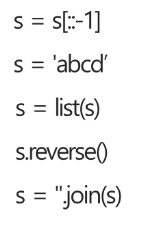

# 08 月12日 string

### ASCII

- 32-126

- 32: 공백
  
  # A: 65 a: 97

- 확장 아스키 표준문자이외의 악센트 문자 도형 문자, 특수문자 , 특수 기호 등을 표현


### 유니코드

- 다루는 변수의 크기에 따라 ucs-2 ucs-4로 나눠짐

- 바이트 순서 표준화  x
  
  ### ====> 외부 인코딩 필요 유니코드인코딩
  
  UTF -8  WEB표준 8비트 이용 7비트쓰는 아스키 코드와비슷
  
  UTF -16 
  
  UTF-32  
  
  파이썬 3. X  default: UTF-8 

윈도우용  한글 인코더: cp-949 =! UTF-8   (가끔 깨지는 이유) 


### python 문자열 처리

# 문자열의 요소값 변경X


-  문자열 뒤집기 
  
  - 새로 빈 문자열을 만들어 소스를 뒤에서 부터 읽어서 타겟에 쓴다



- for 문으로 뒤집기

- 문자열 비교
  
  - ==연산자와 is 연산자를 제공
  
  - is :  문자열 주소도 같으면 True

- 숫자를 문자로

- ```python
  def itoa(num):
      string = ''
      logic = 0
      if num < 0:
          logic = 1
          num = num * -1
      elif num == 0:
          string = '0'
     
      while(num):
          temp = num % 10
          num = num // 10
          string = chr(48 + temp) + string[:]
      if logic == 1:
          string = '-' + string[:]
      return string
  ```


# 패턴 검색 알고리즘

### brute force

```python
def bruteforce(pattern, text):
    N = len (pattern)
    M= len(text)

    for n in range(N - M + 1):
        for j in range(M):
            if pattern[n + j] != text[j]:
                break
        else:
            return n
    return (-1)

```

- 시간 복잡도는 O(MN)


### kmp

- 불일치가 발생한 텓그트 스트링의 앞부분에 어떤 문자가 있는지를 미리 알고있으므로 불일치가 발생한 앞부분에 대하여 다시 비교하지 않고 매칭  O(M+N)

- 전처리 패턴 만들기
  
  - 자기앞에 요소가 그앞에 있는지  확인

[kmp예시]([Visualizing String Matching Algorithms](http://whocouldthat.be/visualizing-string-matching/))


### 보이어 무어

오른쪽에서

```python
def pre_process(pattern):
    M = len(pattern)

    skip_table = dict()
    for i in range(M - 1):
        skip_table[pattern[i]] = M - i -1

    return skip_table


def boyer_moore(text, pattern):
    skip_table = pre_process(pattern)
    M = len(pattern)

    i = 0  # text index
    while i <= len(text) -M:
        j = M -1 # 뒤에서 부터 비교하기떄문
        k = i + M - 1 # 비교 시작 위치

        while j >= 0 and pattern[j] == text[k]:
            j -= 1
            k -= 1
        if j == -1:
            return i
        else:
            i += skip_table.get(text[i+M-1], M)
    return -1

print(boyer_moore('ABC ABCDAB ABCDABCDABDE', 'ABCDABD'))
```

뒤에서 부터 비교해 다른 문자열이 pattern에 있으면 pattern의 위치를변경해 다시 비교
