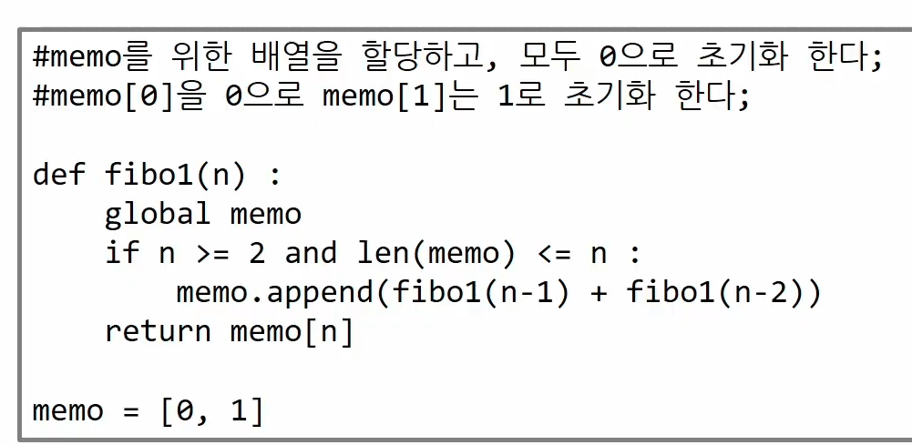

# 스택 후입선출 last in first out

### 자료를 선형으로 저장할수 있는 자료구조

### 마지막 삽입된 원소의 위치를 TOP, stack pointer

### 연산

- push 저장소에 저장, append로 구현

- pop 저장소에서 자료 꺼낸다

- isEmpty 스택이 공백인지 아닌지 확인

- peek 스택에top에 있는 item 반환하는 연산

```python
def push (item, size)
    global top
    top += 1
    if top == size:
        print('overflow')
    else:
        stack[top] = item

size = 10
stack = [0] * 10
top = -1

push(10, size)        # push(1)

top += 1
stack[top] = 20      # push (2)
```

append , pop 시간이 오래 걸림!

```python
def pop():
    if len(s) == 0:
        return
    else:
return s.pop(-1)
```

```python
def pop ():
    global top
    if top == -1:
        print('underflow')
        return 0
    else:
        top -= 1
        return stack[top - 1]

print(pop())


if top > -1:
    top -= 1
    print(stack[top])
```

### 스택 구현 고려 사항

1차원배열 사용시 스택의 크기를 변경하기가 어렵다

동적으로 할당

### 스택 응용1- 괄호 검사

1. 갯수 동일

2. 왼쪽이 오른쪽 괄호보다 먼저

3. 포함관계만 존재

여는 괄호면 push

닫는 괄호면 pop후 비교

괄호가 남으면 error

### 재귀 호출

일방적안 호출방식보다 재귀호출방식이 프로그램 크기를 줄이고 간단하게 작성

### 피보나치 수열

```python
def fibo(n)
    if n < 2:
        return n
    else:
        return fibo(n-1) + fibo (n-2)
```

```py
de f (i,N):
    if i == N:
        return
    else:
        print(A[i])
        f(i+1, N)

N =3
A = [1,2,3]
f(0,N)
```



### 메모이제이션 O(2^2) --->O(N)

이전 피보나치 수열을 저장해 실행시간 감소

# 오후

## DP

### 그리드 알고리즘과 같이 최적화 알고리즘이다

작은 부분문제들을 모두 해결한 후에 그 해들을 이용해 큰 크기의 부분 문제들을 해결

가장 작은 부분 문제 부터 해를 구한다

### 피보나치 수 dp 적용 알고리즘

```python
def fibo2(n):
    for i in range(2, n+1):
        table[i] = table[i - 1] + table[i - 2])


table = [0] * 101
table[0] = 0
table[1] = 1
```

 메모이제이션보다 반복적 구조로 dp를 구현한 것이 성능면에서 효율적이다

### DFS

비선형 구조인 그래프 구조는 그래프로 표현된 모든 자료를 빠짐없이 검색하는것이 중요

1. 시작 정점v를결정하여 방문

2. 정점 v에 인접한 정점중에서
- 방문하지 않은 정점w가 있으면 정점 v를 스택에 push 하고 정점w를 방문한다 w를v로 하여 다시 반복

- 방문하지않은 정점이 없으면 탐색의 방향을 바꾸기 위해 스택을 pop하여 받은 가장 마지막 방문 정점을 v로 하여 다시 반복 
3. 스택이 공백이 될때까지 2를 반복

`visited = [], stack = []`


# ※stack은 pop append 써도 됨※

# ※queue pop(0)가 느리지만 stack은 상관X※
