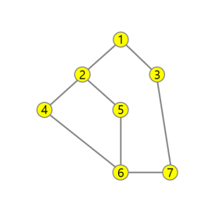

# 0818

### dfs: stack

### bfs: queue

### stack 후입선출

## DFS

### 갈수있는경로가 있는곳 까지 깊이 탐색후 갈 곳이 없으면 마지막에 만났던 갈림길로 돌아와 다시 탐색

### 시작정점 결정후 방문

### 인접정점에서 방문하지 않은 정점이 있으면 스택 push후 방문

### 방문하지않은 정점이 없으면 스택을 pop하여 마지막 방문정점을 방문하여 반복

# 스택이 공백이 될때까지 반복

### 연결됬는지 그래프를 만들어 확인하자

### 재귀함수



input: `1 2 1 3 2 4 2 5 4 6 5 6 6 7 3 7` 

```python
def DFS(now):
    visited[now] = 1
    result.append(now)
    for nxt in range(v+1):
        if graph[now][nxt] == 1 and visited[nxt] == 0:
            DFS(nxt)


edge_list= list(map(int, input().split()))
E = len(edge_list)//2
v = 7
graph = [[0] *(v+1) for _ in range(v+1)]
for i in range(E):
    graph[edge_list[i*2]][edge_list[i*2+1]] = 1
    graph[edge_list[i*2+1]][edge_list[i*2]] = 1

visited = [False] * (v+1)
now = 1
result = []
DFS(1)

print(result)
```


```python
edge_list= list(map(int, input().split()))
E = len(edge_list)//2
v = 7
graph = [[0] *(v+1) for _ in range(v+1)]
for i in range(E):
    graph[edge_list[i*2]][edge_list[i*2+1]] = 1
    graph[edge_list[i*2+1]][edge_list[i*2]] = 1

visited = [False] * (v+1)
now = 1
stack = [now]
result = [now]
while stack:
    visited[now] = 1
    for nxt in range(v+1):
        if graph[now][nxt] == 1 and visited[nxt] == 0:
            stack.append(now)
            now = nxt
            result.append(nxt)
            break
    else:
        now = stack.pop()

print('-'.join(map(str, result)))
```
