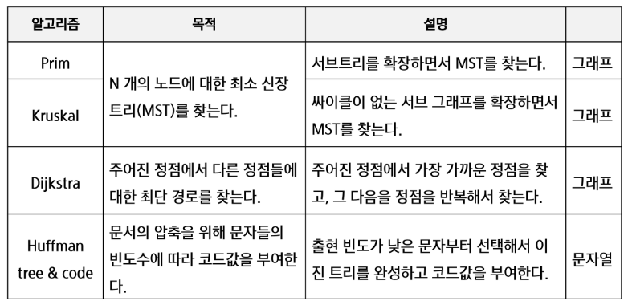

# 0921

### 2진수

- `'f'{x:04b}'` int x를 4자리 2진수로 변경


### 순열

```python

#n: 선택된 원소수  k: 원수 개수


def perm(n,k):
    if i == k:
        print(p)
        return
    else:
        for j in range(i,k):
            p[i], p[j] = p[j],p[i]
            perm(i+1,k)
            p[i],p[j] = p[j],p[i]

p=[1,2,3,4,5]

perm(0,5)
```


- used 리스트 만들기

- 사용하면 1로 변경하고 0이 나오면 사용

- dfs

```python
def perm(n,k):
    if i == k:
        print(p)
        return
    else:
        for j in range(k):
            if used[j] == 0:
                p[i] = a[j]
                used[j] = 1
                perm(i+1, k)
                used[j] = 0
                p[] 


N = 10
R = 3  #고를 갯
a = list(range(1,N+1))
used = [0]*N
p = [0]*N
perm(0,N)
```

`used[0]= 1`, `p[0]=1` 1이 고정인 순열을 만들수있따!

### 조합

- 서로 다른 n개중 r개를 순서없이 골라낸것

```python
N = 10
for i in range(N-2):
    for j in range(i+1, N-1):
        for k in range(j+1, N):
            print(i,jk)
```


- 재귀

```python
def nCr(n,r,s):
    if r==0:
        print(*comb)
    else:
        for i in range(s,n-r+1):
            comb[r-1] = a[i]
            nCr(n,r-1,i+1)

A =[1,2,3,4,5]
n = len(A)
r=3
comb = [0] * r
nCr(n,r,0)
```


# 탐욕알고리즘

# 최적화 값이 아닐수 있음!!

### 거스름돈 줄이기

- 최적해를 구하는데 사용되는 근시안적인 방법

- 한번선택된것은 번복X

- 한번선택하면 그순간 최적인것을 선택

- 단위가 큰 동전부터 거스름돈을 만든다


### 배낭 짐싸기

- 완전탐색 2^n

- 탐욕도 어렵다 ㅜ

- 물건의 일부를 자를 수있다면 ->값/가치로 탐욕으로


### 회의실 배정하기

종료시간 순으로 활동을 정렬

- 종료시간이 가장 빠른 회의 선택

- 그다음 시간에서 선택 가능한  빨리 끝나는 회의 선택

- 반복





