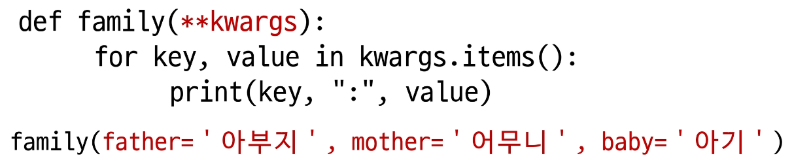
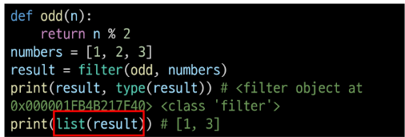

# 07.20

### 조건문

- 삼향 연산자
  
  - `true인 경우 값 if 조건 else false인 경우 값`
  
  - ```python
    valu = num if num >=0 else -num
    ```

### 반복문

- enumerate 순회
  
  - 인덱스오 객체를 쌍으로 담은 열거형 객체 반환
  
  - 0 민수 1 영희 2 철수 ...
  
  - tuple 형태

- dictionary comprehension
  
  - `{key : value for 변수 in iterable}`

### 반복문 제어

- break
  
  - 반복문 종료

- continue
  
  - 이후 코드 블록 수행하지 않고 다음 반복 수행

- pass
  
  - 아무것도 하지 않음

### 함수입력

- 직접 변수의 이름으로 특정 argument를 전달할수있음
  
  - add(x=2, y=5)  O
  
  - add(x=2, 5)    X
  
  - add(2, y=5)   O   마지막으로 사용

- 가변인자 (*args) --튜플
  
  - 여러 개의 postional argument를 하나의 필수 parameter로 받아서 사용
  
  - 몇개의 postional argument를 받을 지 모를때

- 패킹 언패킹
  
  - 언패킹시 변수의 개수와 할당하고자 하느 요소의 갯숙다 동일해야함
  
  - 언패킹시 변수에 *를 추가하면 할당하고 남은 요소를 리스트에 담을수 있음
    
    - ```python
      numbers= 1, 2, 3, 4, 5,)
      a,b, *rest = numbers
      ```

- 가변 키워드 인자 **
  
  - 몇 개의 키워드 인자를 받을지 모르는 함수를 정의할 때 유용



### ※key는 변수처럼※

- scope
  
  - local: 지역 범위
  
  - enclosed scope: 지역 범위 한 단계 위범위
  
  - Global scope: 최상단에 위치
  
  - built-in-scope 모든것을 담고 있는범위(내장함수)

- 바깥 scope의 변수에 접근가능하나 수정 X

- global은 parameter에 사용 불가능

- nonlocal 
  
  - global을 제외한 가장 가까운 scope의 변수에 연결
  
  - 먼저 선언 해야함

### 함수

- filter(function, iterable)
  
  - 순회가능한 데이터구조 모두를 함수에 적용
  
  - 결과가 True인 것을 filter object로 반환



- zip(*iterables)
  
  - 복수의 iterable을 모아 튜플을 원소로 반환

- lambda
  
  ```python
  triangle_area = lambda b, h : 0.5 * b * h
  ```

- 재귀함수
