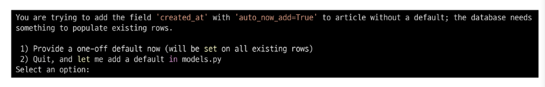

# 0901_django

### variable routing

- 쿼리 스트링 파라미터 : 사용자 입력 

- variable routing url주소 일부를 변수로 지정하여 view함수인자로 넘김
  
  - ex) instagram id를 변수로 넘겨서 각자 다른 프로필을 보여줌
  
  - id별로 html파일을 만들지 않아도 됨, url주소를 여러개 만들지 않아도 됨

`/<변수명>/`

default str

int 0 또는 양의 정수 `/<int:변수>/`

1. 변수명과 views.py의 함수 매개변수의 이름이 같아야 한다

2. variable routing 설정되면 반드시 매개변수로 받아야한다

3. variable routing이 적용된 주소에는 반드시 값이 들어가 있어야한다


### url mapping

- 각각의 앱에서 url 관리

- 하나의 파일에서 하면 유지보수 힘듬


# MODEL

### 모델 작성

models.py 작성

모댈 클래스를 작성 == 데이터베이스 테이블 스키마 정의  

```python
class Aritcle(models.Model):
    title = models.CharField(max_length=10)
    content = models.TextField()
#id 컬럼은 django가 자동으로 생성
```


### migrations

- makemigrations
  
  - 모델 작성, 변경사항으로 migration을 만들때 사용

- migrate 
  
  - 실제  DB에 적용

- showmigration
  
  - migrate됐는지 여부 확인

- sqlmigrate
  
  - 해당 migration파일이 sql문으로 어떻게 해석 될지 미리 확인




- django가 자동으로 default값 추가

- 직접 작성

### DateTimeField()

auto_now_add

- 최초 생성 일자

- 테이블에어떤 값을 최초로 넣을때

auto_now

- 최종 수정일자 수정시 시간 자동 설정


### ORM

django<ㅡ> sQL 데이터 변환프로그래밍기술

 SQL을 몰라도 데이터베이스조작가능

ORM만으로 조작 구현힘듬


### shell

운영체제 상에서 기능과 서비스를 구현하는 인터페이스를 제공하는 프로그램

사용자 <ㅡ>shell <ㅡ> 운영체제

`python manage.py shell`

`python manage.py shell_plus` <- django-extensions? 설치해야됨


### query set

- db에서 전달받은 객체 목록 - 리스트형태   ※음수 인덱스 사용X

- 필터나 정렬등 수행가능 <ㅡ query set API

- DB가 하나의 객체를반환할 때  query set가 아니라 인스턴스로 반환  .get()


# CRUD

### get

- 특정 리소스를 가져오도록 요청할때

- DB에 변화를 주지않을 때

-  crud 중 read만!

- crud 다 사용할수있지만 사용 안함


### post

- 서버로 데이터를 전송할 때 사용

- 서버에 변경사항을 만듦

- 리소스를 생성/변경하기 위해 데이터를 http body에 담아 전송

- url로 데이터보내지X

- create, update, delete에 사용

- form action method=''안적으면 get 적으면 post
