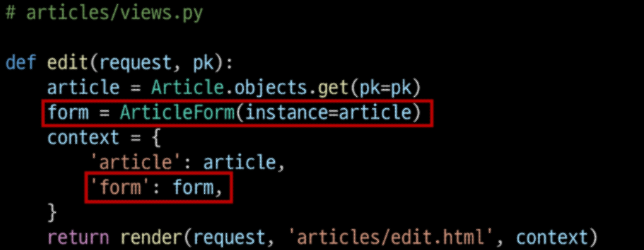
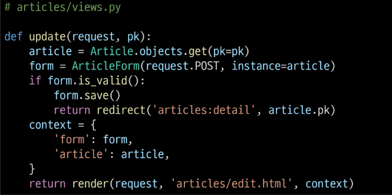

### Django Form

- django 서버로 들어오는 요청을 모두 수용하고 있음

- 유효성 검증이 필요

- 쉽게 검증을 진행할수 있도록 해줌

- 렌더링 위한 데이터 준비 및 재구성

- 데이터에 대한 html form 생성

- 클라이언트로 부터 받은 데이터 수신 및 처리

### form class 선언

- Model Class를 선언하는 것과 비슷

- Model과 마찬가지로 상속을 통해 선언

- 앱 폴더에 form .py 생성후 ArticleForm Class 선언
  
  ```python
  from django import forms
  
  class ArticleForm(forms.Form):
      title = forms.CharField(max_length=10)
      content = fomrs.CharField()
  ```

- 다른곳에 작성해도 되지만 유지보수 차원에서 form.py에서!

```python
#view
from .forms import ArticleForm

def new(request):
    form = ArticleForm()
    context ={
        'form': form,
    }
    return render(request, 'articles/new.html', context)
```

```python
# new.html

{{form}}
```

- 서버 껐다 켜야 반영됨!

- 줄바꿈? textarea?
  
  - form.as_p: 각각의 요소를 <p>로 감쌈
    
    - as_p(): <p>
    
    - as_ul(): <li>
    
    - as_table(): <tr>
  
  - widgets
    
    - input요소 렌더링 담당
    
    - 단순한 출력 부분 담당
    
    - form fields에 할당됨
    
    - ```python
      form.CharField(widget=forms.Textarea)
      ```
    
    - 응용: dropdown
      
      - ```python
        NATION_A = 'kr'
        NATION_B = 'ch'
        NATIONS_CHOICES =[
            (NATION_A, '한국'),
            (NATION_B, '중국'),
        ]
        nation = forms.ChoiceField(choices= NATIONS_CHOICES)
        ```
      - widget = from.RadioSelect

### Django MoedlForm

- ```python
  #articles/forms.py
  
  class ArticleForm(forms.ModelForm):
      class Meta:
          model = Article
          ##fields = ('title', 'content')
          fields = '__all__'
          #exclude = ('title') #에외 처리
  ```

- meta
  
  - modelform의 정보를 작성하는곳
  
  - 사용할 경유 참조할 모델 필요
  
  - meta data : 데이터를 표현하기 위한 데이터

- CRUD
  
  - ↑ 유효성 검증 필요
  
  - ```python
    def create(request):
        form = AritcleForm(request.POST)
        if form.is_valid():
            article = form.save() #저장하고 반환
            return redirect('articles:detail', article.pk)
        #print(f'error: {form error}')
        context = {
            'form': form
        }
        return render(request, 'articles/new.html', context)
    ```
  
  - save method
    
    - form 인스턴스에 바인딩 된 데이터를 통해 데이터베이스 객체를 만들고 저장
    
    - modelform 하위클래스 키워드 인자 instance 여부를 통해 생성할지 수정할지 결정
    
    - instance: 수정 대상
    
    - ```python
      #update
          form = ArticleForm(request.POST, instance=article)
          form.save()
      ```
    
    - 공백과 데이터가 없는건 다름





- 에러 발생시 render해야 에러이유를 띠울수 있다


### form 과 modelform

- form 
  
  - 사용자로부터 받는 데이터가 db와 연관되어 있지 않는 경우
  
  - 단순 데이터로만 사용

- modelform
  
  - 사용자로 부터 받는 데이터가 db와 연관있는 경우
  
  - 유효성 검사가 끝나면 바로 save()호출 가능
