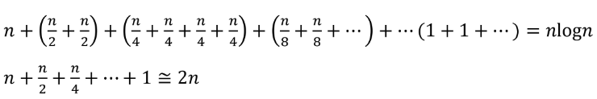

### 20220914_컴퓨터띵킹

log n  컴퓨터 분야의 로그 밑은 항상 2

2^(n log n) = n^n > n!

- ~ ,ㄱ 부정 NOT

- ㅅ 논리곱 and

- V 논리합 or 

- A->B  A이면 B 명제

- 베타 논리합 XOR 하나만 참일때  참이되는 명제

- 쌍방조전 명제: 모두 조건이면서 결론인 명제

### 수의 표현

### DP

재귀함수에서 동일한 입력의 함수호출이 반복될때 그 결과 값을 저장해 두고 블러 쓰는것
