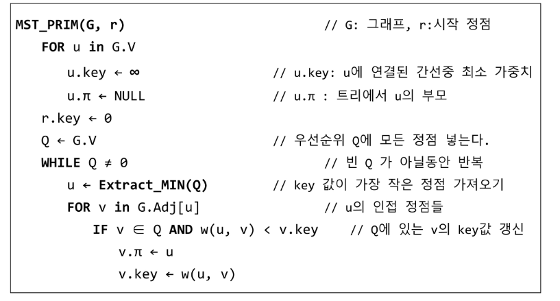
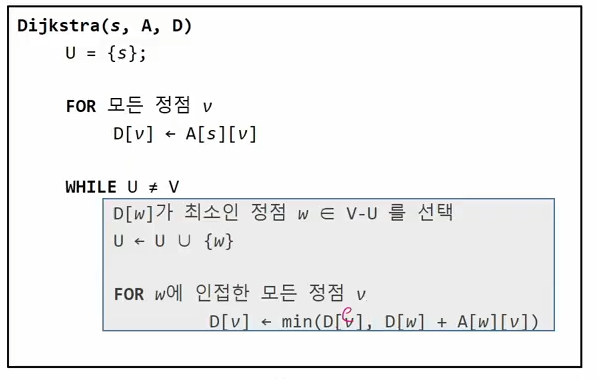

### 0928_algorithm

## 서로소 집합들

- 교집합이 없는 집합

- 하나의 특정 멤버를 통해 각집합을 구분한다

표현방법

- 연결 리스트

- 트리
  
  - 하나의 집합이 하나의 트리로 표현
  
  - 자식노드가 부모노드를 가리키며 루트 노드가 대표자

연산

- make-set(x)
  
  - `p[x] = x`

- find-set(x)
  
  - `if x == p[x]: return x`
  
  - `else: return find-set(p[x])`

- union(x,y)
  
  - `p[find-set(p[y])] = find-set[x]`

## MST

모든 정점을 연결하는 간선들의 가중치의 합이 최소가 되는 트리

두 정점사이의 최소 비용으로 경로 찾기

- 신장 트리: n개의 정점과 n-1개의 간선으로 이루어진 트리

- 최소신장트리: 무방향 가중치 그래프에서 신장트리를 구성하는 간선들의 가중치의 합이 최소인 신장 트리

### PRIM

하나의 정점에서 연결된간선들중 하나씩 선택하면서 mst 만드는 방식

임의 정점 선택

선텍힌 장점과 인접하는 정점들 중의 최소비요의 간선이 존재하느 정점 선택

모든 정점이 선택 될때까지 반복

### KRUSKAL

모든 간선을 가중치에 따라 오름차순으로 정렬

가중치가 가장 낟은 간선부터 선택하면서 트리 증가

- 사이클이 존재하면 다음으로 가중치가 낮은 간선 선택
  
  - find_set()으로  같은 트리안에 있는지 확인

n-1개의 간선이 선택 될때까지 반복

# 최단경로

### 다익스트라 음의가중치 허용 x

### 벨만포드 음의가중치 허용

### 플로이드 워샬 알고리즘: 모든 정점에대한 경로

## dijkstra

시작정점에서 거리가 최소인 정점을 선택해 나가면서 최단경로를 구하는 방식

인접한 정점을 거쳐서 가는 경우가 최단경로면 갱신 

탐욕기법을 사용한 알고리즘

