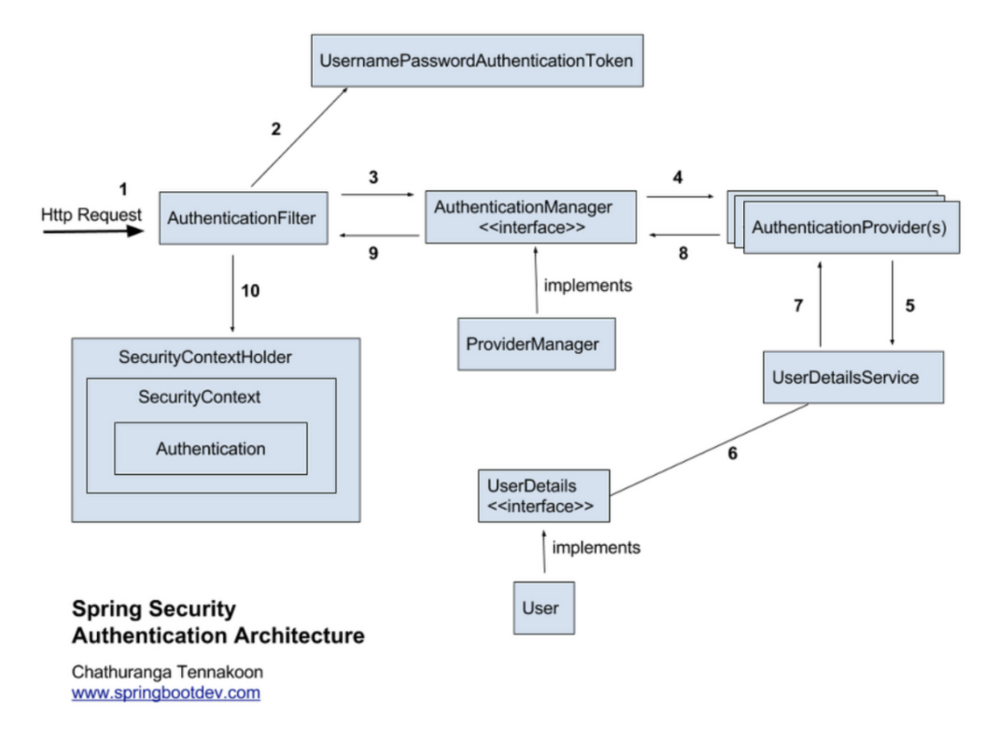

# security

### 

1. Http Request가 서버로 넘어온다.
2. 가장먼저 AuthenticationFilter가 요청을 낚아챈다.
3. AuthenticationFilter에서 Request의 Username, password를 이용하여 UsernamePasswordAuthenticationToken을 생성한다.
4. 토큰을 AuthenticationManager가 받는다.
5. AuthenticationManager는 토큰을 AuthenticationProvider에게 토큰을 넘겨준다.
6. AuthenticationProvider는 UserDetailsService로 토큰의 사용자 아이디(username)을 전달하여 DB에 존재하는지 확인한다. 이 때, UserDetailsService는 DB의 회원정보를 UserDetails 라는 객체로 반환한다.
7. AuthenticationProvider는 반환받은 UserDetails 객체와 실제 사용자의 입력정보를 비교한다.
8. 비교가 완료되면 사용자 정보를 가진 Authentication 객체를 SecurityContextHolder에 담은 이후 AuthenticationSuccessHandle를 실행한다.(실패시 AuthenticationFailureHandler를 실행한다.)


하나의 SecurityFilterChain 을 구성하기 위해서 WebSecurityConfigurerAdapter 를 상속한 클래스에서 configue() 메소드를 오버라이딩 하는 방식

 Spring Security 5.7.1 부터는 SecurityFilterChain 을 직접 Bean 으로 등록해서 사용하는 방식을 권고

```java
    @Bean
    public SecurityFilterChain filterChain(HttpSecurity http) throws Exception {
        // CSRF 설정 Disable
        http.csrf().disable()

                // exception handling 할 때 우리가 만든 클래스를 추가
                .exceptionHandling()
                .authenticationEntryPoint(jwtAuthenticationEntryPoint)
                .accessDeniedHandler(jwtAccessDeniedHandler)

                // h2-console 을 위한 설정을 추가
                .and()
                .headers()
                .frameOptions()
                .sameOrigin()

                // 시큐리티는 기본적으로 세션을 사용
                // 여기서는 세션을 사용하지 않기 때문에 세션 설정을 Stateless 로 설정
                .and()
                .sessionManagement()
                .sessionCreationPolicy(SessionCreationPolicy.STATELESS)

                // 로그인, 회원가입 API 는 토큰이 없는 상태에서 요청이 들어오기 때문에 permitAll 설정
                .and()
                .authorizeRequests()
                .antMatchers(AUTH_ARR).permitAll()
                .anyRequest().authenticated()   // 나머지 API 는 전부 인증 필요

                // JwtFilter 를 addFilterBefore 로 등록했던 JwtSecurityConfig 클래스를 적용
                .and()
                .apply(new JwtSecurityConfig(tokenProvider));

        return http.build();
    }

```


**출처**

https://velog.io/@jkijki12/Spirng-Security-Jwt-%EB%A1%9C%EA%B7%B8%EC%9D%B8-%EC%A0%81%EC%9A%A9%ED%95%98%EA%B8%B0
