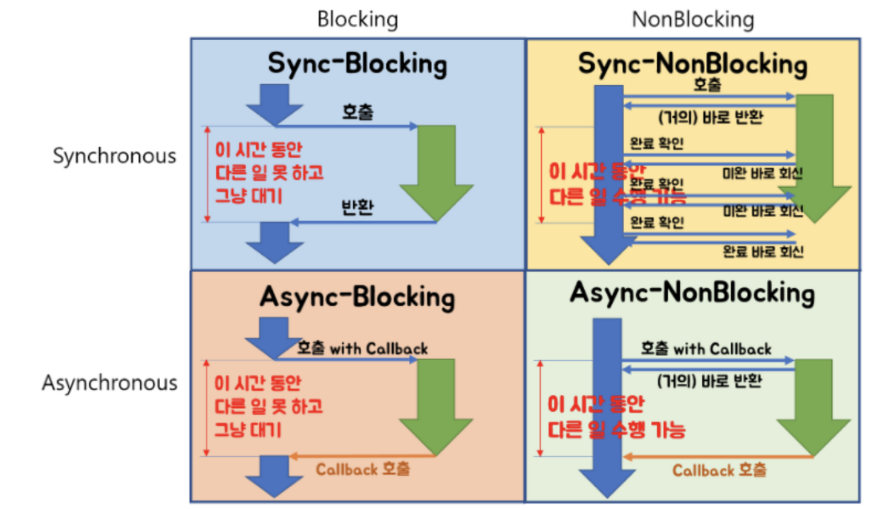

### 블록킹 논블록킹 신크 어신크



### blocking/ non blocking

-  **호출되는 함수가 바로 리턴하느냐 마느냐가 관심사**

- **Blocking** : 함수 B는 내 할 일을 다 마칠 때까지 제어권을 가지고 있는다. A는 B가 다 마칠 때까지 기다려야 한다.

- **Non-blocking** : 함수 B는 할 일을 마치지 않았어도 A에게 제어권을 바로 넘겨준다. A는 B를 기다리면서도 다른 일을 진행할 수 있다.

### Synchronous/Asynchronous

- 동기/ 비동기

-  **호출되는 함수의 작업 완료 여부를 누가 신경쓰냐가 관심사**

- **Synchronous** : 함수 A는 함수 B가 일을 하는 중에 기다리면서, 현재 상태가 어떤지 계속 체크한다.
  
  - 호출하는 함수가 호출되는 함수의 작업 완료 후 리턴을 기다리거나, 또는 호출되는 함수로부터 바로 리턴 받더라도 작업 완료 여부를 호출하는 함수 스스로 계속 확인하며 신경쓴다,

- **Asynchronous** : 함수 B의 수행 상태를 B 혼자 직접 신경쓰면서 처리한다. (Callback)
  
  - 호출되는 함수에게 callback을 전달해서, 호출되는 함수의 작업이 완료되면 호출되는 함수가 전달받은 callback을 실행하고, 호출하는 함수는 작업 완료 여부를 신경쓰지 않음
    - 완료후 콜백 요청해야 작업완료됨!!

##### 예시

- **Blocking-Async의 대표적인 케이스가 Node.js와 MySQL의 조합**
  
  - MySQL 드라이버가 blocking  형식이다

```
blocking: wait queue 에 들어가고, 시스템 콜이 완료된 후에 응답을 보냄.
non-blocking: wait queue 에 들어가지 않고, 즉시 리턴함. (응답 또는 에러코드)
동기(sync): wait queue 에 머무는게 필수가 아니고, 시스템 콜의 완료를 기다림.
비동기(async): 즉시 리턴하고, 시스템콜의 완료을 기다리지
않음.
```
