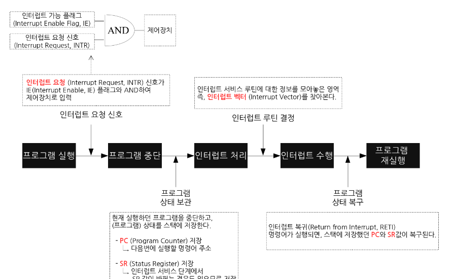

# 운영 체제

자원/시스템 자원

- 프로그램 실행에 있어 필요한 요소

- 컴퓨터 네가지 핵심 부품 포함

- 네트워크, 패킷도 포함

운영체제

- 프로그램에 필요한 자원을 할당

- 프로그램이 올바르게 실행되도록 돕는 

- **특별한 프로그램**

- 커널 영역에 적재

- 응용 프로그램과 하드웨어 사이

### 커널

- 자원에 접근하고 조작하는 기능

- 프로그램이 올바르고 안전하게 실행하는 기능

#### 이중모드

- cpu 가 명령어를 실행하는 모드를 사용자 모드와 커널모드로 구분

- 사용자 모드
  
  - 자원 접근 불가
  
  - 커널 영역의 코드를 실행 불가
  
  - 운영체제 서비스 제공 받지X
  
  - 시스템 호출시 커널모드로 전환

- 커널 모드
  
  - 운영체제 서비스 제공받음
  
  - 자원접근 가능

### 운영체제 핵심 서비스

- 프로세스 관리
  
  - 많은 프로세스 동시에 실행
  
  - 와! 프로세스와 스레드 동기화, 데드락

- 자원 접근 및 할당
  
  - cpu 스케쥴링
  
  - 메모리 페이징 스와핑
  
  - 입출력 장치 (하드웨어 인터럽트 서비스 루틴?)[[컴퓨터구조] 인터럽트(Interrupt)란?](https://whatisthenext.tistory.com/147)

인터럽트란?

- cpu의 정상적인 프로그램 실행을 방행

- 내부 인터럽트

- 1. 하드웨어 고장(Hardware Interrupt)
     - 컴퓨터 고장
     - 데이터 전달 과정에서의 비트 오류
     - 전원이 나간 경우
  2. 실행할 수 없는 명령어 : 기억장치에서 인출한 명령어의 비트 패턴이 정의되어 있지 않은 경우
  3. 명령어 실행 오류 : 나누기 0을 하는 경우
  4. 사용 권한 위배 : 사용자가 운영체제만 사용할 수 있는 자원에 액세스하는 경우

- 외부 인터럽트
  
  1. 타이머 인터럽트 : 타이머가 일정한 시간 간격으로 중앙처리장치에게 인터럽트를 요청 
  2. 입출력 인터럽트 : 속도가 느린 입출력장치가 입출력 준비가 완료되었음을 알리기 위해 인터럽트를 요청

- `인터럽트 서비스 루틴`
  
  - 어떤 소스(source)가 인터럽트 요청을 하면 반복적으로 수행하는 일이 있다는 뜻이다. 다른 말로 `인터럽트 핸들러`(interrupt handler)라고도 한다.

