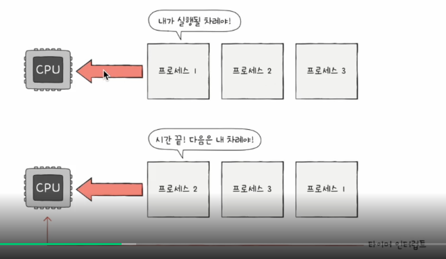
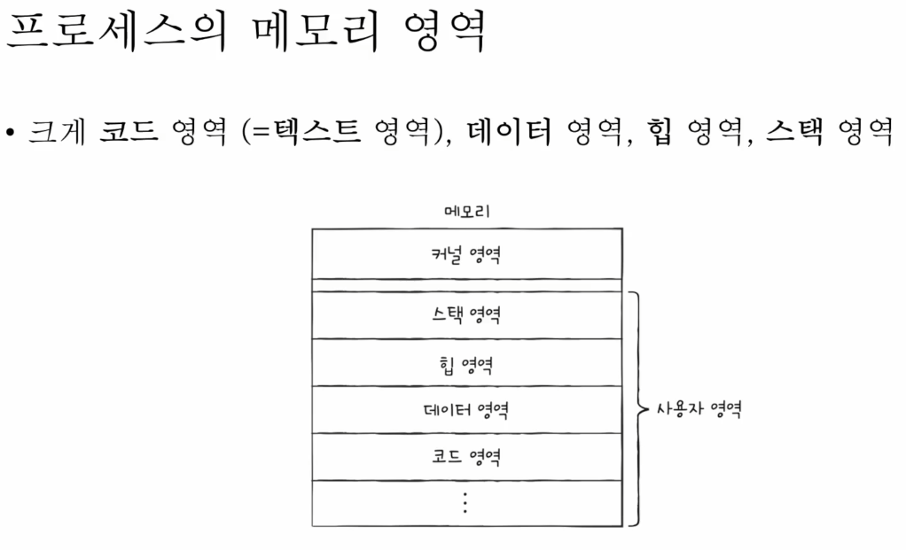
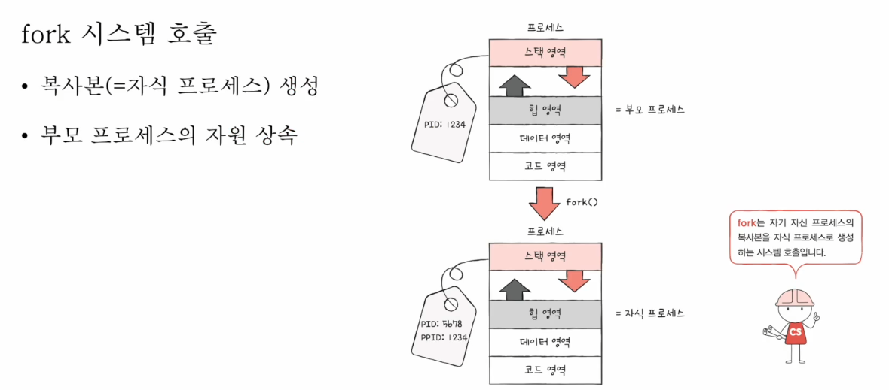

# 프로세스와 스레드

cpu의 자원 한정, 프로세스는 많아요

타이머 인터럽트가 발생하면 차례 양보(클럭  신호)

 **프로세스 제어 블록**

- 빠르게 번갈아 수랭되는 프로세스의 관리

- 프로세스 제어블록라는 자료구조 사용
  
  - 프로세스 관련 정보 저장
    
    - 프로세스  id
    
    - 레지스터값
    
    - 프로세스 상태
    
    - 스케쥴링 정보
    
    - 메모리 정보(페이지 테이블 정보 포함)
    
    
  
  - 커널 영역에 생성, 폐기

**컨텍스트 스위칭**

- 한 프로세스가 다른 프로세스로 실행순서가 넘어가면
  
  - 기존의 프로세스의 중간 정보 백업
  
  - 다음 프로세스의 중간정보 복구

- PCB에 저장

**정적영역**

- 코드 영역
  
  - 기계어로 저장된 명령어
  
  - cpu가 실행할 명령어가 저장
  
  - read-only

- 데이터 영역
  
  - 프로그램이 실행되는 동안 유지할 데이터저장
  
  - 전역 변수

**동적영역**

- 힙영역
  
  - 사용자가 할당할수 있는 저장
  
  - 가비지 컬렉션
  
  - 옛날 친구들은 가비지 컬렉션없음 -> 메모리 누수
  
  - 낮은 주소에서 높은 주소로 할당

- 스택영역
  
  - 데이터가 일시적으로 저장되는 공간
  
  - 매개변수, 지역변수
  
  - 높은 주소에서 낮은 주소로 할당
    
    - 힙영역과 겹치는걸 피하기위해서

# 프로세스 상태와 구조

PCB에 기록되는 프로세스 상태

**생성 상태**

- 이제 막 메모리에 적재

**준비 상태**

- cpu 할당받아 실행가능(디스패치)

- 자신의 차례가 아니여서 대기

**실행 상태**

- cpu를 할당받음

- 타이머 인터럽트 발생시 준비상태로

- 입출력장치 끝날때까지 대기 상태

**대기 상태**

- 프로세스 실행중 입출력장치를 사용하는 경우

- 입출력 작업이 cpu에 비해 느려 대기 상태로 접어듬

- 입출력 완료 인터럽트를 받으면 준비상태로

**종료 상태**

- 프로세스 종료된 상태

- PCB, 프로세스 메모리 영역 정리

### 프로세스 계층 구조

**(윈도우X)**

프로세스 실행도중 다른 프로세스 생성가능

부모, 자식 프로세스

- 별개의 pid값

- 부모 프로세스 pid 기록하기도 함(ppid)

- fork 시스템 호출로 자신의 복사본을 자식 프로세스로 생성

- exec 호출로 자신의 메모리 공간을 다른 프로그램으로 교체
  
  - 자신의 메모리공간을 새로운 프로그램으로 덥어쓰는 시스템

# 스레드

프로그램 실행 흐름의 단위

하나의 프로세스는 하나이상의 스레드 가질수있음

- 여러 명령어를 동시에 실행 가능

구성(실행에 필요한 최소한의 정보)

- 스레드 id

- 프로그램 카운터를 포함한 레지스터 값

- 스택, ...

**프로세스의 자원 공유!!**

요즘은 스레드 단위로 cpu에 전달한다고 한다

명시적으로 프로세스와 스레드를 구분하지 않음

**멀티 프로세스와 멀티 스레드 차이**

- 스레드끼리 자원 공유

- 프로세스 fork시 모든 자원 복제
  
  - 메모리 주소를 제외한 모든 프로세스가 메모리에 저장?

- 협력 통신에 멀티 스레드가 유리
  
  - 멀티 프로세스는 프로세스간 통신 (IPC)를 해야되서 추가 비용
  
  - 파일이나 공유메모리를 통해 통신도 함

- 문제 발생시 전염될수있어 멀티 프로세스가 유리
