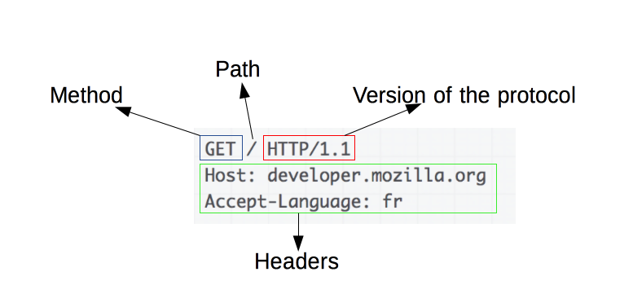

# HTTPS

#### http (hyperText Transfer Protocol)

- TCP/ IP 위에서 작동

- Method, Path, Version, Headers, Body

- 인터넷 상에서 클라이언트와 서버가 자원을 주고 받을때 쓰는 통신 규약

- 네트워크에서 신호를 가로채면 내용이 노출되는 이슈 존재 (감청)

#### HTTPS (HyperText Transfer Protocol Secure)

- SSL 프로토콜을 사용해 클라이언트와 서버가 자원을 주고 받을 때 쓰는 통신 규약

- 텍스트를  공개키로  암호화

- 대칭키, 비대칭 키 모두사용
  
  - 대칭키 암호화 
    
    - 클라이언트와 서버가 동일한 키로 암호화/복호화
  
  - 비대칭키 
    
    - 1개의 쌍으로 구성된 공개키와 개인키를 암호화/복호화 하는데 사용함
    
    - 키가 노출되어도 비교적 안전하지만 연산 속도가 느림

- **흐름**
  
  - hand-shaking 과정에서 세션키를 교환, 이 과정에 비대칭 키 사용
    
    - seession: 데이터를 암호화하는데 사용되는 대칭키
  
  - 클라이언트가 서버로 연결시도
  
  - 서버는 공개키(인증서) 전달
  
  - 인증서 유효성 검사후 세션키 발급(by browser)
  
  - 공개키로 암호화 하여 서버로 세션키 전송
  
  - 서버는 개인키로 세션키 복호화
  
  - 데이터 전달시 세션키로 암호화/ 복호화 진행

- **발급 과정**
  
  - HTTPS 적용을 위해 공개키 개인키 만든다
  
  - 신뢰할 수 있는 CA기업에 공개키를 저장하는 인증서 발급 요청
    
    - ***CA란?*** : Certificate Authority로, 공개키를 저장해주는 신뢰성이 검증된 민간기업
  
  - CA기업의 개인키로 암호화여 인증서를 서버에 제공
  
  - 서버의 공개키로 암호화된 https 요청이 아니면 인증서를 클라이언트에게 전송
  
  - CA의 공개키는 브라우저에서 알수 있따
  
  - CA의공개키로 해당 인증서의 디지털 서명이 유효한지 검증

### 
