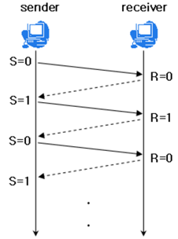
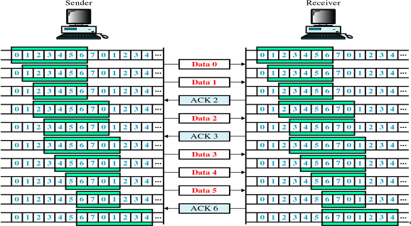

# TCP 흐름제어 혼잡제어

### TCP 통신

- 네트워크 통신에서 신뢰적인 연결방식

- 생길 수 있는 문제점
  
  - 패킷 손실
  
  - 패킷 순서 바뀜
  
  - 네트워크 혼잡
  
  - 리시버가  overload되는 문제

- **흐름 제어**
  
  - 송신측 속도가 수신측 속도보다 빠를 때 패킷 손실이나 추가 패킷 전송이 발생
  
  - 송수신측의 TCP 버퍼 크기 차이로 인해 생기는 데이터 처리 속도 차이를 해결하기 위한 기법
  
  - **TCP 버퍼란?**  
    송신 측은 버퍼에 TCP 세그먼트를 보관한 후 순차적으로 전송하고, 수신 측은 도착한 TCP 세그먼트를 애플리케이션이 읽을 때까지 버퍼에 보관한다.
  
  - 해결 방법
    
    - ##### stop and wait
      
      - 매번 전송한 패킷에 대해 확인 응답을 받아야 다음 패킷 전송
      
      - 
      
      - 비효율적 ;(
    
    - ##### sliding window
      
      - 수신측에서 설정한 윈도우 크기만큼 송신측에서 세그먼트를 전송 
      
      - 목적 : 전송은 되었지만, acked를 받지 못한 byte의 숫자를 파악하기 위해 사용하는 protocol
      
      - 3 way handshaking에서 수신 측 윈도우 크기로 설정
      
      - 수신측 버퍼에 남은 공간에 따라 변한다
      
      - 확인 응답 (ACK)를 보낼 때 TCP헤더에 담아서 보낸다
      
      - 
        
        -  수신 측으로부터 확인 응답(ACK)을 받지 못하면, 패킷을 재전송
          
            
  
  - 혼잡 제어
    
    - 라우터에 데이터가 몰린경우-> 데이터 손실 -> 재전송 -> 넽웤 혼잡
    
    - 네트워크 혼잡을 피하기위해 데이터 전송 속도를 줄인다
    
    - ##### AIMD additive increase/ multicative decrease
      
      - 패킷 전송에 문제가 없으면 윈도우의 크기를 1 증가
      
      - 실패하면 윈도우 크기 절반으로
      
      - 너무 천천히 증가해 오래걸린다
    
    - ###### slow start
      
      - 지수적으로 증가
      
      - 혼잡 발생시 윈도우 사이즈 1
      
      - slow start threshold 임계점
        
        - 이 지점까지 slow start 쓰겠다
        
        - 이후는 aimd
      
      - ###### 빠른 회복 (Fast Recovery)
        
        빠른 회복은 혼잡한 상태가 되면 윈도우 크기를 1로 줄이지 않고 반으로 줄이고 선형 증가시키는 방법이다. 이 방법을 적용하면 혼잡 상황을 한 번 겪고나서부터는 AIMD 방식으로 동작한다.
      
      - ##### 빠른 재전송
        
        - 순서대로 잘 도착한 마지막 패킷의 다음 순번을 ACK 패킷에 실어서 보낸다. 그리고 이런 중복 ACK를 3개 받으면 재전송
        
        - 타임 아웃 시간이 지나지 않았어도 바로 해당 패킷을 재전송할
        
        - aimd 방식으로 다시 작동

### 예상 면접 질문과 답변

#### TCP/IP 통신에서 흐름 제어 기법이 왜 사용되는가?

#### TCP/IP 흐름 제어 기법은 무엇이 있는가?

#### TCP/IP 혼잡 제어 기법이 왜 사용되는가?

#### TCP/IP 혼잡 제어 정책은 무엇이 있는가?

출처 [[네트워크] TCP/IP 흐름 제어 &amp; 혼잡 제어](https://steady-coding.tistory.com/507)
