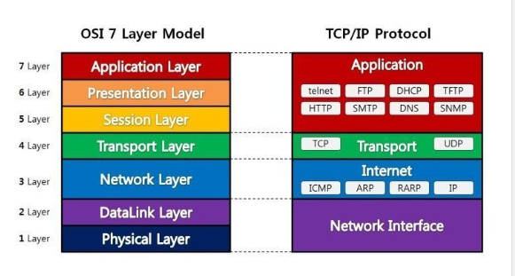

# osi 7 계층

-> TCP/IP 4계층

### 1. physical layer

- 데이터를 전기적, 기계적인 특성을 이용해 전송

- 전달만하기 떄문에 애러, 어떤 데이터인지 관심X

- 통신 케이블, 리피터, 허브
  
  - HUB
    
    - 다수의 pc와 장치를 묶어서 LAN을 구성할때 각ㄱ가의 pc에 연결된 노드들을 한곳에 모으는 역할을 하는 장치, 네트워크 구성해줌
    
    - 데이터에 표시된 목적지인 MAC 주소를 보고 자신의 것과 비교한 후  
      맞으면 받아들이고, 아니면 버린다.
  
  - 리피터: 신호를 증폭하여 다음 구간으로 재전송하는 장치

### 2. DataLink Layer

- 물리 계층으로 송수신되는 정보를 관리하여 안전하게 전달

- Mac주소로 통신
  
  - MAC 주소(Media Access Control Address)는 네트워크 인터페이스에 할당된 고유
    식별자이며 보통 장치의 NIC에 할당됩니다.
    48비트로 이루어져있으며 24비트의 OUI와 24비트의 UAA로 이루어져있습니다.
    
    - OUI : IEEE에서 할당한 제조사 코드
    - UAA : 제조사에서 구별되는 코드
  
  - 유일하지만 유일하지 않을 수 있음

- 에러 검출, 재전송, 흐름 제어를 진행

- point to point간 신뢰성있는 전송을 보장

- 브리지, 스위치
  
  - 스위치:
    
    - mac 주소와 포트번호가 기록된 mac주소 테이블을 가지고 있음
    
    - 네트워크 스위치는 네트워크 내의 장치를 연결하고 해당 장치와 데이터 패킷을 주고받습니다.라우터와 달리 스위치는 여러 장치의 네트워크가 아닌 의도된 단일 장치로만 전송
  
  - 브리지
    
    - 가지고 있는 MAC 주소를 비교해서 데이터를 전송
    
    - 없는 주소라고 하면 송신 포트를 제외하고 모든 포트로 보낸다.  

### 3. Network Layer

- 데이터를 목적지까지 가장 안전하고 빠라르게 전달(routing)

- 라우터를 통해 이동할 경로를 선택하여 IP 주소를 지정하고, 해당 경로에 따라 패킷을 전달(주소 부여)

- 흐름제어
  
  - 수신 측에서 송신 측이 송신하는 데이터의 전송량이나 전송 속도를 조절하는 기능

- 오류제어
  
  - 전송 중에 발생하는 오류를 검출하고 정정하여 정보의 파손에 대비하는 기능

- 순서제어
  
  - 데이터 블록에 전송 순서를 부여하는 기능. 송신 데이터들이 순서적으로 전송되도록 함으로써 흐름제어와 오류제어를 용이하게 합니다.

- 패킷 손실이 생기는 경우 :(
  
  - **결함이 있는 이더넷 포트 또는 케이블.**
  
  - **PC의 네트워크 인터페이스 컨트롤러(NIC) 문제.**
  
  - **구형 라우터 펌웨어.**
  
  - **네트워크 혼잡.**
  
  - **게임 서버 문제.**

### 4. Transport layer

- TCP, UDP 프로토콜을 통해 통신 활성화

- 포트를 열어 프로그램들이 전송할수있도록 제공
  
  - TCP : 신뢰성, 연결지향
    
    - 송수신 연결 확인
    
    - 패킷 손실, 중복, 순서 바뀜들이 없도록 보장
  
  - UDP : 비신뢰성, 비연결성, 실시간
    
    - 일방적으로 데이터 전송
    
    - 응답 안기다림

- 오류 검출, 흐름제어, 중복 검사 수행

- 만약 데이터가 왔다면 4계층에서 해당 데이터를 하나로 합쳐서 5계층으로ㄲ

- 데이터 전송 단위는 **Segment**이며,
  
  - 송신 시, 데이터 분할을 통해 각 세그먼트에 시퀀스 넘버를 부여하고
  - 수신 시, 시퀀스 넘버에 따라 재조립하여 데이터의 무결성과 정확성을 검사

### 5. session layer

- API, Socket

- 데이터가 통신하기 위한 논리적 연결을 담당한다. TCP/IP 세션을 만들고 없애는 책임을 지니고 있다.
  
  - 4계층에서도 연결을 제어할수있다

- 세션 설정, 유지, 종료, 전송 중단시 복구

- **동시 송수신 방식(duplex), 반이중 방식(half-duplex), 전이중 방식(Full Duplex)** 의 통신과 함께, 체크 포인팅과 유휴, 종료, 다시 시작 과정 등을 수행한다. https://velog.io/@xxell-8/OSI-7-Layers

### 6. presentation layer

- 데이터 표현에 대한 독립성을 제공하고 암호화하는 역할을 담당한다.

- 파일 인코딩, 명령어를 포장, 압축, 암호화한다

- 데이터 구조를 하나의 통일된 형식으로 표현하여 응용계층의 데이터 형식 차이로 인한 부담을 덜어줍니다

- jpeg, mpeg,..

### 7. application layer

- HTTP, FTP, DNS **( domain name system)**
  
  - 해당 통신 패킷들은 방금 나열한 프로토콜에 의해 모두 처리되며 우리가 사용하는 브라우저나, 메일 프로그램은 프로토콜을 
    
    보다 쉽게 사용하게 해주는 응용프로그램이다

- 최종 목적지로, 응용 프로세스와 직접 관계하여 일반적인 응용 서비스를 수행.

- 사용자 인터페이스, 전자우편, 데이터베이스 관리 등의 서비스를 제공.
