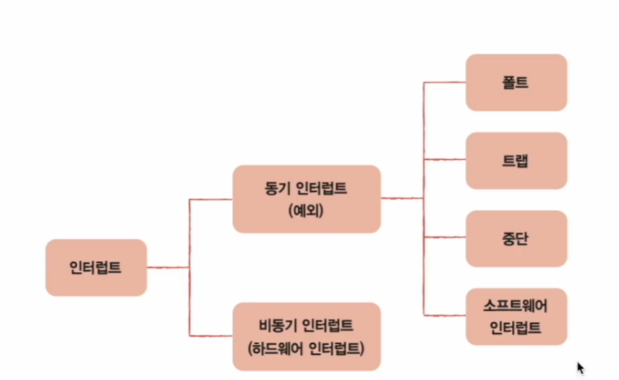
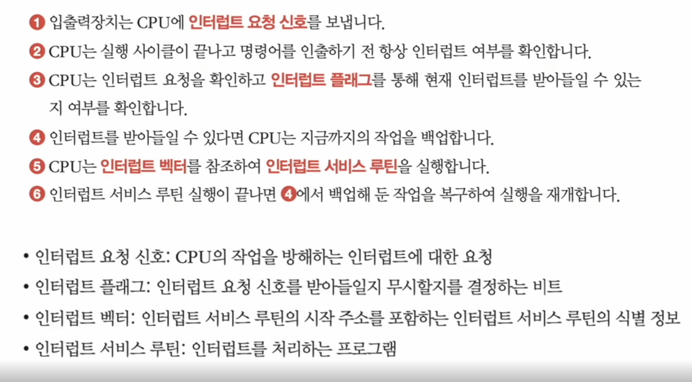

# 명령어 사이클과 인터럽트

인출 사이클

- 메모리에서 명령 인출

실행 사이클

- 실행

인출 실행 사이클 돌아감

### 인터럽트

cpu 사이클을 방해하는 신호

동기 인터럽트

- cpu가 예기치 못한 상황을 접했을 때 발생
  
  

비동기 인터럽트

- 주로 입출력 장치에 의해 발생

- 알림과 같은 역할

- 모든 인터럽트를 인터럽트 플래그로 막을수 없다

인터럽트 서비스 루틴

- 해당 인터럽트를 어떻게 처리할지 저장된 프로그램

