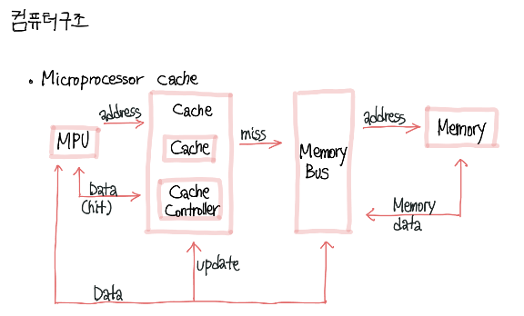
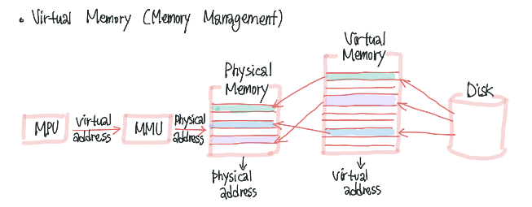

## 컴퓨터의 구성

**하드웨어** : 컴퓨터를 구성하는 기계적 장치

**소프트웨어** : 하드웨어의 동작을 지시하고 제어하는 명령어 집합

#### 하드웨어

---

- 중앙처리장치(CPU)
- 기억장치 : RAM, HDD
- 입출력 장치 : 마우스, 프린터

#### 소프트웨어

---

- 시스템 소프트웨어 : 운영체제, 컴파일러
- 응용 소프트웨어 : 워드프로세서, 스프레드시트

먼저 하드웨어부터 살펴보자

하드웨어는 중앙처리장치(CPU), 기억장치, 입출력장치로 구성되어 있다.

이들은 시스템 버스로 연결되어 있으며, 시스템 버스는 데이터와 명령 제어 신호를 각 장치로 실어나르는 역할을 한다.

##### 중앙처리장치(CPU)

인간으로 따지면 두뇌에 해당하는 부분

주기억장치에서 프로그램 명령어와 데이터를 읽어와 처리하고 명령어의 수행 순서를 제어함 중앙처리장치는 비교와 연산을 담당하는 **산술논리연산장치(ALU)**와 명령어의 해석과 실행을 담당하는 **제어장치**, 속도가 빠른 데이터 기억장소인 **레지스터**로 구성되어있음

개인용 컴퓨터와 같은 소형 컴퓨터에서는 CPU를 마이크로프로세서라고도 부름

##### 기억장치

프로그램, 데이터, 연산의 중간 결과를 저장하는 장치

주기억장치와 보조기억장치로 나누어지며, RAM과 ROM도 이곳에 해당함. 실행중인 프로그램과 같은 프로그램에 필요한 데이터를 일시적으로 저장한다.

보조기억장치는 하드디스크 등을 말하며, 주기억장치에 비해 속도는 느리지만 많은 자료를 영구적으로 보관할 수 있는 장점이 있다.(ROM)

##### 입출력장치

입력과 출력 장치로 나누어짐.

#### 시스템 버스

> 하드웨어 구성 요소를 물리적으로 연결하는 선

각 구성요소가 다른 구성요소로 데이터를 보낼 수 있도록 통로가 되어줌

용도에 따라 데이터 버스, 주소 버스, 제어 버스로 나누어짐

##### 데이터 버스

중앙처리장치와 기타 장치 사이에서 데이터를 전달하는 통로

기억장치와 입출력장치의 명령어와 데이터를 중앙처리장치로 보내거나, 중앙처리장치의 연산 결과를 기억장치와 입출력장치로 보내는 '양방향' 버스임

##### 주소 버스

데이터를 정확히 실어나르기 위해서는 기억장치 '주소'를 정해주어야 함.

주소버스는 중앙처리장치가 주기억장치나 입출력장치로 기억장치 주소를 전달하는 통로이기 때문에 '단방향' 버스

##### 제어 버스

주소 버스와 데이터 버스는 모든 장치에 공유되기 때문에 이를 제어할 수단이 필요

제어 신호 종류 : 기억장치 읽기 및 쓰기, 버스 요청 및 승인, 인터럽트 요청 및 승인, 클락, 리셋 등

읽기 동작과 쓰기 동작을 모두 수행하기 때문에 '양방향' 버스임

컴퓨터는 기본적으로 **읽고 처리한 뒤 저장**하는 과정으로 이루어짐

(READ → PROCESS → WRITE)

이 과정을 진행하면서 끊임없이 주기억장치(RAM)과 소통한다. 이때 운영체제가 64bit라면, CPU는 RAM으로부터 데이터를 한번에 64비트씩 읽어온다.

- Miss: 요청한 데이터가 캐시에 존재하지 않음

- hit: cpu가 요청한 데이터가 캐시에 존재하는 경우

- `miss rate = misses/cache access`

- MPU가 주소 요청
  
  - cache에 있으면(hit) mpu와 cache에서 데이터 교환

- 없으면 해당 주소를 가지고 메모리 버스로

- 해당 주소로 메모리 데이타 받아온다

#### virtual memory

- 프로세스의 결과를 메모리에 다 올리지 않아도 되도록하는 기술

- 결과가 메모리보다 커도 된다

- 프로세스 생성, 파일공유때 유용하게 써요

- virtual memory를 physical memory에 맵핑시켜 필요할때 만쓰고

- 메모리에 loading되는page외의 메모리는 backing store(disk)에 저장

#### 
