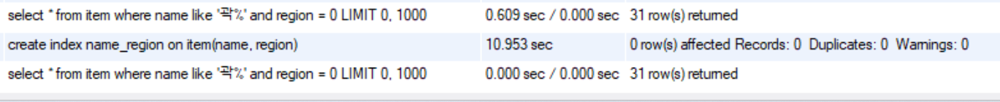

1. pageable 사용
   
   `select item0_.id as id1_0_, item0_.name as name2_0_, item0_.number as number3_0_, item0_.region as region4_0_ from item item0_ limit ?, ?`

800~640ms 소모


2. 이름시작과 지역으로 조회

`http://localhost:8080/item/list/곽/1/?page=0&size=20`

`findByNameStartingWithAndRegion(name, region, pageable)`

`select count(item0_.id) as col_0_0_ from item item0_ where (item0_.name like ? escape ?) and item0_.region=?`

700~800ms

`create index name_region on item(name, region);`

8ms?

```java
@Data
@Entity
@NoArgsConstructor
@Table(name = "Item")
public class Item {
    @Id
    @GeneratedValue(strategy = GenerationType.IDENTITY)
    private Long id;
    @NotNull
    @Column(name = "name", unique = false)
    private String name;

    @NotNull
    @Column(name = "number")
    private String number;

    private int region;

    @Builder
    public Item(String name, String number, int region){
        this.name = name;
        this.number = number;
        this.region = region;
    }
}
```





