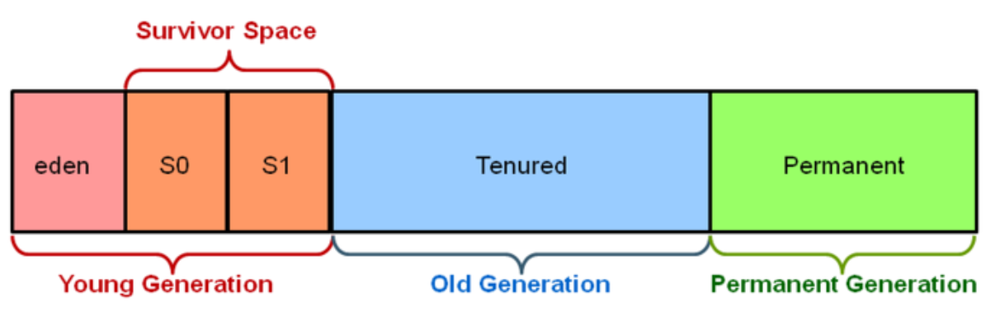

# Garbage Collection

**대상**

1. 객체가 NULL인 경우 (ex. String str = null)

2. 블럭 실행 종료 후, 블럭 안에서 생성된 객체

3. 부모 객체가 NULL인 경우, 포함하는 자식 객체

## 메모리 해제 과정

1. 마킹
   
   메모리가 사용되는지 마킹
   
   모든 오브젝트를 스캔하기에 오래 걸림
   
   

2. Normal Deletion
   
   객체를 제거, 메모리 반환
   
   위치를 저장해 두었다가 새 오브젝트 선언시 할당
   
   

3. compacting
   
   남은 객체들을 묶습니다
   
   

## Weak Generational Hypothesis

신규로 생성한 객체의 대부분은 금방 사용하지 않는 상태가 되고, 오래된 객체에서 신규 객체로의 참조는 매우 적게 존재한다는 가설입니다.

이 가설에 기반하여 자바는 Young 영역과 Old 영역으로 메모리를 분할하고, 신규로 생성되는 객체는 Young 영역에 보관하고, 오랫동안 살아남은 객체는 Old 영역에 보관합니다.

## Generational Gabage Collection

1. Young 영역(Yong Generation 영역)
   
   새롭게 생성한 객체의 대부분이 여기에 위치합니다. 대부분의 객체가 금방 접근 불가능 상태가 되기 때문에 매우 많은 객체가 Young 영역에 생성되었다가 사라집니다. 이 영역에서 객체가 사라질때 **Minor GC** 가 발생한다고 말합니다.

2. Old 영역(Old Generation 영역)
   
   접근 불가능 상태로 되지 않아 Young 영역에서 살아남은 객체가 여기로 복사됩니다. 대부분 Young 영역보다 크게 할당하며, 크기가 큰 만큼 Young 영역보다 GC는 적게 발생합니다. 이 영역에서 객체가 사라질 때 **Major GC(혹은 Full GC)** 가 발생한다고 말합니다.

3. Permanet 영역
   
   Method Area라고도 합니다. JVM이 클래스들과 메소드들을 설명하기 위해 필요한 메타데이터들을 포함하고 있습니다. JDK8부터는 PermGen은 Metaspace로 교체됩니다.

## Generational Garbage Collection 과정

1. 새로운 객체 eden space에 할당

2. 가득차면 minor gc 시작

3. 참조되는 객체는 survivor(s0)로 이동, 비 참조 객체 반환

4. 다음 minor gc에 s1로 참조된 객체이동 -> 다양한 aged 객체 존재

5. 반복

6. 특정 age therhold 넘으면 old gen으로 이동

survivor space 가득차도 gcㄲㄲ

Survivor Spaces가 가득 차서 더 이상 객체를 옮길 수 없게 되면, GC는 객체들을 Old Generation으로 이동

