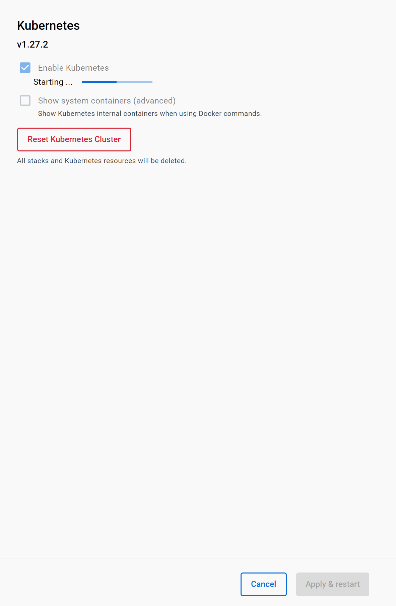
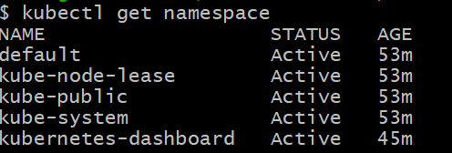

# 03. 쿠버네티스

## 3.1 쿠버네티스 아키텍쳐

도커와 컨테이너는 전반적이고 추상화된 기술을 제공

쿠버네티스는 다량의 컨테이너를 하나의 물리적인 서버에 배치하여 이를 사용하듯이 관리

쿠버네티스는 크개 2 영역

- 노드를 하나로 묶는 클러스터를 관리하는 컨트롤 플레인

- 각 노드를 관리하는 노드 영역

### 컨트롤 플레인 컴포넌트

클러스터에 관한 결정을 내리고 클러스터 이벤트를 감지하며 반응

클러스터내 어떤 머신에서도 동작 가능

 **kube-apiserver** 쿠버네티스의 모든 컴포넌트의 통신을 담당

**etcd** 모든클러스터 데이터를 담는 쿠버네티스의 뒷단의 저장소로 사용되는 키 밸류 저장소

**kube-scheduler** 노드가 배정되지않은 새로 생성된 파드를감지하고 실행할 노드를 선택하는 컴포넌트

**kube-controller-manager** 컨트롤러 구동하는 컴포넌트

**cloud-controller-manager** 클라우드 제공 상업자와 상호작용하는 컨트롤러

**node-component** 동작중인 파드를 유지시키고 쿠버네티스 런타임 환경을 제공

**kublet** 클러스터의 각 노드에서 실행되는 에이전트

**kube-proxy** 클러스터의 각노드에서 실행되는 네트워크 프록시, 쿠버네티스 서비스 개년 구현부

**container- runtime** 컨테이너 실행을 담당하는 소프트웨어, 도커, containerd, cri-o, kubernetes cri 등의 여러 컨테이너 런타임을 지원한다.

## 3.2 설치

docker desktop setting에서 설치가능, 리눅스는 책 116p 참조

[Kubernetes with Docker Desktop 환경 설정](https://mydailylogs.tistory.com/120)

쿠버넹티스 대시보드나 K9s를사용해 관리 가능

##### 컨테이너 실행

`kubectl run nginx-app --image nginx --port=80`

`kubectl get pods`

`kubctl expose pod nginx-app --type=NodePort`

`kubectl get service`

`kubectl delete pod nginx--app`

`kubectl delete svc nginx--app`

## 3.3 쿠버네티스 오브젝트

모든 요소를 YAML파일로 생성하여 관리 할수 있다.

### 3.3.1 네임스페이스

하나의 물리적인 공간에 있는 쿠버네티스를 다수의 팀이 사용할때 유용

각팀이 사용하는 부분이 서로 영향을 끼칠수 있기 때문

네임 스페이스로 논리적으로 분리할수있따

`kubectl run nginx --image = nignx --namespace= team1`

`kubectl get pod -m team1` 네임스페이스가 team1인 포드만 조회

### 3.3.2 파드

쿠버네티스의 구성요소중 가장 작은 단위의 객체

해당 클러스터에서 러닝 프로세스

 파드 내에 여러 컨테이너 존재가능

### 3.3.2.1 생명주기

`pending` 파드가 쿠버네티스 시스템에 의해 승인되었지만 하나이상의 컨테이너 이미지 생성이 아직 완료X

`Running` 파드가 한 노드에 결합되고 모드 컨에티너 생성이 완료

하나의 컨테이너가 동작중이거나 시작또는 재시갖중

zn`Succeded` 파드으 ㅣ모든 컨테이너가 성공적으로 생성됨

`Failed` 파드의 모든 컨테이너가 종료, 적어도 하나이상의 컨테이너가 실패로 종료

`unknown` 어떤 이유에 의해 파드의 상태를 얻을수없음, 보통 통신 오류

### 디플로이먼트

파드와 레플리카 셋에 대한 선언과 업데이트 제공하는 상위 개념의 컨트롤러

`replicas: 1`  레플리카를 늘리고 싶으면 수정

`kubectl apply -f nodejs.yaml` 적용

`kubectl roolout status deployment.~` 롤 아웃 명령어로 업데이트가 잘되었는지 확인

파드는 언제든지 생성되고 없어지므로 디플로이먼트로같은 컨트롤러를 사용한다.

### 서비스

파드 접근 정책

NodePort: 각 노드의 ip에 노출할 포트

ClusterIP

LoadBalancer: 클라우드 공그밪의 로드밸런서 사용

### 인그레스

클러스터 외부에서 내부로 접속 가능

`kubectl expose`보다 많은 기능

ingress-nginx가 있다

다른 파드들을 ingress에 연결해 외부 노출 -> `-type=NodePort` 사용X게이트웨이로 간단하게 사용가능

### 스토리지

컨테이너화 하지 않을 데이터 부분

pg/data?

볼륨 리스트는 쿠버네티스 도큐먼트에서 찾자

PV: 볼륨

PVC:볼륨 사용요청

`kubectl get pv` , `get pvc`로 확인

생명주기

프로비저닝: 퍼시스턴트 볼륨 생성

바인딩:

사용중:

리클레이밍: 퍼시스트 볼륨 클레임 삭제

accessModes

- ReadOnlyMany:  동시에 읽기 전용 접근

- ReadWriteOnce: 여러 노드 동시 마운트 불가, 같은 노드에서 여러 파드 공유 가능

- ReadWriteOncePod: 한 파드만 

- 

### 노드

- 파드를 실행할수 있는 물리적 공간

상태

- 레디
- 낫레디
- pid pressure
- diskpressure
- network unavilable

노드 설치: join 명령어 추가

### 네트워크

#### CNI

파드 간 노드간 통신하는 네트워크 인터페이스 ,calico 플러그인ㄲ

컨테이너간 네트워크

- 파드내 여러 컨테이너 배치 X -> 레플리카 때문

Kubctl exec nodejs-app -c mysql-app --ping node-js-app

​                         파드               컨테이너         명령어

파드간 네트워크

- 파드기준으로 레플리카 생성하기때문에 파드간 통신유리
- 다른 노드에 있어도 통신가능해야한다
- 파드마다 IP 각각 할당
- 파드 수시로 생성/삭제 -> IP로 통신하면 안됨
- 컨테이너 명으로 통신

### 스케줄링

 어떤 방식에 의해 파드를 배치라는것

장애 발생시 가장 필요

1. 파드생성 요청
2. api server에 전달
3. API server는 etcd에 저장
4. api server는 스케줄러에 정보 전달
5. 스케줄러는 적절한 노드 선정 후 api server에 전달
6. api server에서 kubelet을 통해 컨테이너 생성

스케줄링 단계

- 노드 필터 -> 포트, 리소스, 호스트 네임 등
- 우선순위 계산
- 실제 예약 작업

노드 네임, 노드 설렉터 -> 라벨을 이용하여 파드를 배치

diff -f example.yaml 로 어떤 점이 변경되었는지 확인 가능

### 쿠버네티스 DNS

파드 통신시 ip 대신 hostname, subdomain으로 통신

- **호스트네임(Hostname)**: 개별 Pod의 이름.
- **서브도메인(Subdomain)**: 같은 네임스페이스에서 그룹화된 Pod의 도메인 이름.

`spec`  에 해당 정보 기입

 `128-10-31-61.default.pod.cluster.local:3306`

`hostname.subdomain.default.svc.cluster.local`

`nslookup`  `domain -> IP`

dns역할을 하는 kube-dns 하나의 파드

`dnsConfig, dnsPolicy`에 값을 지정해 내용 수정가능

다음과 같은 DNS 레코드를 자동으로 생성

- **서비스 이름**: `service-name.namespace.svc.cluster.local`

### 스케줄링 조절
- 노드 네임 `spec: nodeName: kube-node1`
- 라벨: `nodeSelector: env: test`, `kubectl label nodes kube-node1 env=test`
- 노드 어피니티: 노드 셀렉터보다 유연

### 컨피그 맵, 시크릿
- 배포 환경마다 다른 설정값 필요한 경우
- 보안등 민감한 환경변수들 변수로 관리
- 시크릿은 메모리에 저장하므로 용량에 주의
- 시크릿은 base64로 저장