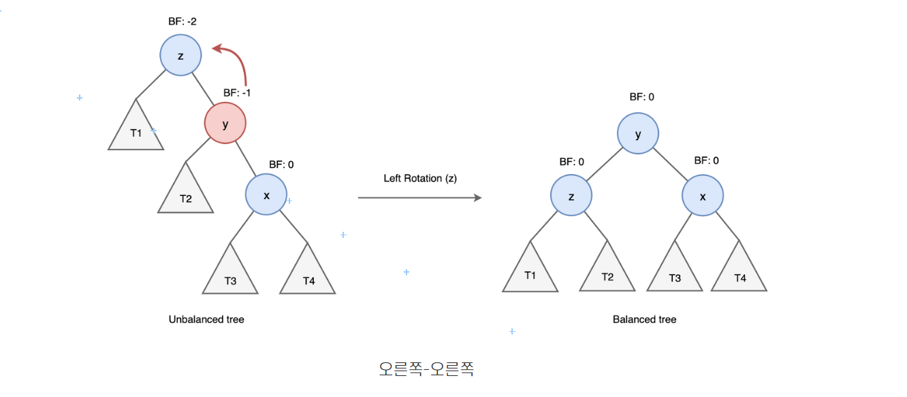

# AVL TREE

자기 균형 이진 탐색 트리 

SELF BALANCED BINARY SEARCH TREE

각 노드의 서브 트리의 높이 차이가 최대 1을 유지

균형 계수 BALANCE FACTOR

불균형시 탐색성능이  O(N) 으로 떨어지는 문제 해결

### 회전 연산


새로 insert한 3으로 인해 불균형

put_item 재귀상태

2 - 5 - 4 -3

put_item(node 3)

노드 3 좌우에는 노드가 없으므로 balance(node) = node3

put_item(node 4)

bf =1

put_item(node 5)

bf = 1

put_item(node 2)

bf = 2

우측 자식 우회전 연산


node 2에서 좌회전 연산


왼쪽 -오른쪽 연산



```python
    def different(self, node:Node) -> int:
        return self.height(node.left) - self.height(node.right)

    def left_turn(self, node:Node) -> Node:
        x = node.right
        node.right = x.left
        x.left = node
        node.height = max(self.height(node.right), self.height(node.left)) + 1
        x.height = max(self.height(x.right), self.height(x.left)) + 1
        return x

    def right_turn(self, node:Node) -> Node:
        x = node.left
        node.left = x.right
        x.right = node
        node.height = max(self.height(node.right), self.height(node.left)) + 1
        x.height = max(self.height(x.right), self.height(x.left)) + 1
        return x
```

```py
    def balance(self, node:Node) -> Node:
        if self.different(node) > 1:
            if self.different(node.left) < 0:   #왜 0인데? -> left 길이 늘려서 단순화?
                node.left = self.left_turn(node.left) #한번에 줄읻기?
            node = self.right_turn(node)
        elif self.different(node) < -1:
            if self.different(node.right) > 0:
                node.right = self.right_turn(node.right)
            node = self.left_turn(node)
        return node
```
